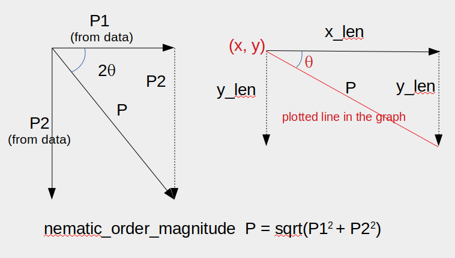

# Planar Cell Polarity Calculation and Plotting

### Planar Cell Polarity

Planar cell polarity (PCP) is the cell polarity within the plane of the epithelium. A group of genes was discovered to be gentically required proper PCP specification.  Many of their protein products are also planar polarized.  Read reviews for more details, [review1](https://dev.biologists.org/content/144/2/187) [review2](http://jcb.rupress.org/content/207/2/171) [review3](https://www.ncbi.nlm.nih.gov/pubmed/19560358)

### Quantification of PCP
The quantitative method was developed to calculate PCP from images that labels PCP protein in  Aigouy et. al., 2010 [paper](https://www.cell.com/cell/fulltext/S0092-8674(10)00890-1?_returnURL=https%3A%2F%2Flinkinghub.elsevier.com%2Fretrieve%2Fpii%2FS0092867410008901%3Fshowall%3Dtrue.).  
 
The associated software package "Tissue Analyzer" has been further updated, refering the [link](https://grr.gred-clermont.fr/labmirouse/software/WebPA/) for more details.  The program is distributed as a plugin of [Fiji-image J](https://imagej.net/Fiji) 

The program calculates many aspects of cell morphologies and export data to sql databases that can be queried and exported as csv files. PCPs can also be plotted. But PCP angles are not calculated by "Tissue Analyzer".  

I wrote the Python script in Jupyter notebook format to calculate the angle. PCPs were replotted and compared to the PCPs plotted by Tissue Analyer to make sure the calculation wascorrect.

The relevant features for the PCP are "center_x_cells", "center_y_cells", "P1_polarity_ch2" and "P2_polarity_ch2"
* "center_x_cells" (x) and "center_y_cells" (y) labels the position of the cell.
* "P1_polarity_ch2" (P1) and "P2_polarity_ch2" (P2) are related to the PCP of the cells. The red line were plotted at position (x, y) with angle θ and length P (often rescaled such as 0.05 x P) in the picture below.  

### The script 

PCPquantification.ipynb

### Lisence 

You are allowed to used and modify the script.  Please refer to this depository in your public presentations and publications.
